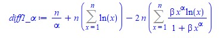

# Práctica 1: Método de la transformación inversa

Aplicar el método de la transformación inversa y/o el de aceptación rechazo para construir una función en R que genere datos de la siguiente distribución:

**Distribución log exponencial-geométrica (Jodra y Jimenez, 2020) **: 
  


Con dominio **x={0..1}, α > 0, β > 0**
  

## Metodo de transformacion Inversa

El método de la transformada inversa como también se le conoce se suele utilizarse para simular variables aleatorias continuas, lo cual se logra mediante la función acumulada f(x) y la generación de números pseudoaleatorios que siguen una distribución uniforme ~U (0,1). En este caso para el cálculo de la función de distribución acumulada dada una función de densidad usando el método de la transformación inversa requiere de cálculos matemáticos complejos dada la función con la que se está trabajando por lo que es necesario usar algún software matemático para la resolución de integrales, inversa, derivadas, etc. Para estos cálculos se emplea el software Maple el cual, es un paquete matemático multiplataforma, bastante intuitivo y sencillo de usar. Para la aplicación del método de transformación inversa se seguirá los siguientes pasos:


1. Definir la función de densidad en Maple
  
   >Pdf := (x, alpha, beta) -> alpha*(beta + 1)*x^(alpha - 1)/(1 + beta*x^alpha)^2;
  
   


2. Integrar y simplificar la función de densidad
  
   >(int(Pdf(x, alpha, beta), x = 0 .. t) assuming (0 < alpha, -1 < beta));simplify(%);
  
   

3. Obtener la La función de distribución acumulada:

   >Cdf := (x, alpha, beta) -> (beta + 1)*x^alpha/(1 + beta*x^alpha)
  
   

4. Calcular la función inversa de la función de distribución acumulada y simplificar

   >solve(Cdf(x,alpha,beta)=u,x);simplify(%);
  
  

5. Obtener la función inversa de F o función cuantil:

   >Q := (u, alpha, beta) -> (-u/(beta*u - beta - 1))^(1/alpha)
  
   
  

6. Programar en R una función que implemente el método de la transformada inversa para crear de forma automatizada muestras aleatorias que siguen la Distribución log exponencial-geométrica (Jodra y Jimenez, 2020). 


## Importar librerías necesarias
```{r setup, warning=FALSE,message=FALSE}
library("ggplot2")
library("dplyr")         # load
library("RcmdrMisc")
library("nleqslv")       # Resolver sistema ecuaciones lineales/no lineales
library("matrixcalc")
library("zeallot")       # Many parameters
library("fitdistrplus")  # Ajustan por máxima verosimilitud 
library("goftest") 

```

## Función de Distribución log exponencial-geométrica en R 

Definimos función en R que aplica el método de la transformación inversa la cual como su nombre lo indica hace uso de la función inversa de la distribución acumulada, también llamada función cuantil que al pasarle como parámetros un vector de tamaño n que sigue una distribución Uniforme(0,1), y los estimadores alpha y beta retorna un vector de valores de tamaño n  que siguen una distribución log exponencial-geométrica (Jodra y Jimenez, 2020). También se define la función de densidad PdfX para validar la correctitud de las variables aleatorias creadas con la función Datos JoJi. 
```{r}
# Función para generar v.a.i.i.d siguiendo dist. log exponencial-geométrica
DatosJoJi <- function(α,β,n){
  # α -> valor del estimador alpha
  # β -> valor del estimador beta
  # n -> tamaño del vector de variables aleatorias que se quieren generar
  
  VectorUnif<-runif(n,0,1) # n datos uniforme (0,1)

  # función cuartil evaluada
  return ((- VectorUnif /( β * VectorUnif - β - 1))^(1/α))

}

# Función de densidad
PdfX<- function(x,n){(α*(1 + β)*x^(α-1))/(1 + β*x^α)^2 }

```

## Muestras aleatoria que siguen la distribución log exponencial-geométrica
```{r}
# Declaramos los valores de α,β,n
α=3; 
β=2;
n=1000;

# Llamamos la función DatosJoJi con sus respectivos parámetros
Dist_log_exp_geometrica = DatosJoJi(α,β,n)

# Graficamos un histograma con las variables obtenidas
Hist(Dist_log_exp_geometrica, scale="density", breaks="Sturges", col="darkgray")

# Añadimos la curva de validación a la gráfica
curve(PdfX(x), from=0, to=1.0, lwd=2, cex = 1.1, col="red",add=TRUE)

```

---


# Práctica 2: Métodos de Estimación

Implementar en R un Métodos de Estimación para la siguiente función de densidad:

**Distribución log exponencial-geométrica (Jodra y Jimenez, 2020)**: 
  


Con dominio **x={0..1}, α > 0, β > 0**

Para el cálculo de los estimadores existen varios métodos, en este caso nos centraremos en el método de los momentos y máxima verosimilitud.

## Método de los Momentos 

El método de los momentos consiste en tomar como estimadores de los momentos de la población a los momentos de la muestra. Para determinar el valor de los estimadores se igualan los momentos poblacionales con los correspondientes momentos muestrales, planteando tantas ecuaciones como parámetros desconocidos se tengan (en este caso dos alpha y beta), resolviendo luego el sistema de ecuaciones para los parámetros
desconocidos. Finalmente, se proponen como estimadores de los parámetros a aquellos valores que son soluciones del sistema de ecuaciones. [1](http://dcb.fi-c.unam.mx/profesores/irene/Notas/Metodo_de_los_momentos.pdf)

Para determinar los estimadores alpha y beta se usa el método de los momentos, por lo que seguimos los siguientes pasos:

1. Definir la función de densidad en el software matemático Maple

   >Pdf := (x, alpha, beta) -> alpha*(beta + 1)*x^(alpha - 1)/(1 + beta*x^alpha)^2

2. Integrar la función usando el software Maple 

   Para determinar el valor de los estimadores alpha y beta, calculamos las siguientes integrales.

   >(int(x*Pdf(x, alpha, beta), x = 0 .. 1) assuming (0 < alpha, 0 < beta));
  simplify(%);

   >(int(x^2*Pdf(x, alpha, beta), x = 0 .. 1) assuming (0 < alpha, 0 < beta));
  simplify(%);

3. Ecuación general de Los momentos poblacionales respecto al origen

   
Obtenida la función de momentos poblacionales respecto al origen procedemos a realizar la implementación en R.

### Método de los momentos
```{r}
VData = DatosJoJi(α,β,n) # n muestras aleatorias

M1 = mean(VData)   # Momentos muestrales 
M2 = mean(VData^2) # Momentos muestrales

# Función con el sistema de ecuaciones
SistemaM <- function(x) {
    # ALPHA x[1]
    # BETA x[2]
  
    y <- numeric(2)
    y[1] <- (x[1]*(x[2]+1) - 1^(x[1]+1)/(1+x[2]*1^(x[1]))^2 )-M1
    y[2] <- (x[1]*(x[2]+1) - 1^(x[1]+2)/(1+x[2]*1^(x[1]))^2 )-M2
    return(y) 
}

# Resolver el sistema
xstart <- c(0.1,1) # puntos de inicio para los estimadores
SolSistem<-nleqslv(xstart, SistemaM, jacobian=TRUE)

# Estimaciones método de los momentos:
alphaM = SolSistem$x[1]; 
message(sprintf("alphaM = %s por método de los momentos", alphaM))
betaM = SolSistem$x[2]; 
message(sprintf("betaM = %s por método de los momentos", betaM))


```
Estos resultados obtenidos con la función implementada permiten comprobar que el método de los momentos no permite obtener estimadores de los parámetros para esta función. Esto se deduce también al ver el resultado de los momentos respecto al origen, tanto beta como alpha son argumentos de la función de Lerch y no es posible obtener estimaciones resolviendo el sistema formado por las ecuaciones E[X]-M1=0 y E[X^2]-M2=0, siendo M1 y M2 los momentos muestrales de orden 1 y 2, respectivamente.

## Metodo de maxima verosimilitud

El método de máxima verosimilitud consiste en tomar una muestra aleatoria independiente e idénticamente distribuidas de tamaño n de una población X con función de probabilidad Pθ (o con función de densidad fθ). Para cada muestra particular (x1,...xn), la función de verosimilitud se define como la función de probabilidad (o de densidad) conjunta de (X1,..Xn) evaluada en esos puntos. Se desea calcular el estimador máximo verosímil para alpha y beta a partir de una muestra aleatoria simple de tamaño n. Para lograr el objetivo empleando el método de máxima verosimilitud seguimos los siguientes pasos:

1. Escribir la verosimilitud de la función de densidad

   

2. Aplicar logaritmo a la función verosímil obtenida previamente para lograr la función de log-verosimilitud:

   

3. Calcular las primeras derivadas:

   - Primera derivada respecto alpha
  
     
  
   - Primera derivada respecto beta
  
     
    
4. Determinar la matriz Hessiana 

   Dado que se desea calcular el valor de dos estimadores la condición de máximo local de la solución (alpha^, betha^) se determinará a partir de la matriz hessiana de log L(α, β).Por lo que se calcula las segundas derivadas de la función.
   
   - Segunda derivada respecto beta 
   
     
    
   - Segunda derivada respecto alpha 
   
     

   - Segunda derivada mixta 
   
     

Una vez realizado los cálculos matemáticos necesarios se procede a implementar el método en R.

### Implementacion del Metodo de Maxima verosimilitud en R
```{r}
# Función de log-verosimilitud:
LogLike <- function(params){
  alpha = params[1]
  beta = params[2]
  x = miid
  
  LL = sum(n*log(alpha) + n*log(beta + 1) + n*(alpha - 1)*log(x) - 2*n*log(1 + beta*x^alpha))
  return(LL)
}

# Definición de la función Gradiente 
Gradiente <- function(params){
  alpha = params[1] # valor inicial de alpha
  beta = params[2]  # valor inicial de beta
  x = miid
  
  Grad1<-sum(n/alpha +n* log(x) - 2*n*beta*x^alpha*log(x)/(1 + beta*x^alpha))
  
  Grad2<-sum(n/(beta + 1) - 2*n*x^alpha/(1 + beta*x^alpha))
  
  Gradi<-c(Grad1,Grad2)

  return(Gradi)
}

# Definición de la función para el cálculo de las segundas derivadas
seg_derivadas<-function(params){
  alpha = params[1]
  beta = params[2]
  x = miid
  
  A11 = sum((-1)*(n/alpha^2) - 2*n*beta*(log(x)^2)*(x^alpha)/(1 + beta*x^alpha)^2)

  A12 = sum((-2)*n*(log(x)*x^alpha)/(1 + beta*x^alpha)^2)

  A22 = sum((-1)*n/(beta + 1)^2 - 2*n*(x^(2*alpha))/(1 + beta*x^alpha)^2)
  return(c(A11,A12,A22))

}


```

### Metodo de resolucion tradicional
```{r}
# Declaramos los valores de α,β,n
α=2; 
β=3;    
n=10000; # Número de datos a generar

miid = DatosJoJi(α,β,n) # Generamos n muestras

# Punto de inicio
inicio<-c(1,1) 

SolSistema<-nleqslv(inicio, fn=Gradiente)

# Soluciones del sistema
alphaMV = SolSistema$x[1]
message(sprintf("alphaMV = %s por método de MV", alphaMV))

betaMV = SolSistema$x[2]
message(sprintf("betaMV = %s por método de MV", betaMV))

# Inició el valor de alphaMV y betaMV obtenido
va = LogLike(c(alphaMV,betaMV)) # Evalua Log-likelihood
message(sprintf("Valor de Log-likelihood en el óptimo es 
                va = %s ", va))

c(A11, A12, A22) %<-% seg_derivadas(inicio)

Determ = A11%*%A22-A12%*%A12
A11 # Primer menor: ha de ser negativo")
Determ # Segundo menor: ha de ser postivo:")

```
Una vez estimados los parámetros es necesario hacer cálculos necesarios para validar que el Hessiano es definido negativo y el segundo menor es positivo. Para la construcción del Hessiano se usaron las segundas derivadas calculadas y operaciones tradicionales de matrices para calcular el determinante. Se puede observar que con una muestra igual a 10000 las aproximaciones son bastantes buenas, se arrojan valores de alpha y beta bastante cercanos a los originales. 

Por temas prácticos y comparativos se usará la implementación Broyden–Fletcher–Goldfarb–Shanno(BFGS) con el paquete de R que trae implementado el método constrOptim el cual únicamente necesita la función y su gradiente, pero no la matriz Hessiana. Por el contrario, este la proporciona. De este modo será posible establecer una comparativa entre ambos resultados.

### Algoritmo BFGS
```{r}
# Punto inicial
inicio<-c(1,1) 

# Algoritmo BFGS
SolBFGS<-constrOptim(inicio,LogLike,Gradiente, method="BFGS", ui=rbind(c(1,0), c(0,1)), ci=c(0,0), control=list(fnscale=-1),hessian=TRUE)

# Estimaciones de parámetros
alphaMV = SolBFGS$par[1]
message(sprintf("alphaMV = %s por método de MV ", alphaMV))

betaMV = SolBFGS$par[2]
message(sprintf("betaMV = %s por método de MV ", betaMV))

message(sprintf("Valor de log-verosimilitud lv = %s ", SolBFGS$value))

H = SolBFGS$hessian
message(sprintf("Proporciona la matriz hessiana H= "))
H

message(sprintf("Determinante de H es det(H) = %s ", det(H)))

# Comprobamos la matriz hessiana con las soluciones BFGS es definida negativa
# library(matrixcalc)

message(sprintf("La matriz es definida negativa[%s]",is.negative.definite(H)))

```
### Algoritmo de Nelder-Mead
```{r}
# Algoritmo de Nelder-Mead
SolNelderMead<-constrOptim(inicio,LogLike,Gradiente,method="Nelder-Mead",
 ui=rbind(c(1,0), c(0,1)), ci=c(0,0), control=list(fnscale=-1),hessian=TRUE)

# Estimaciones de parámetros
alphaMV = SolNelderMead$par[1]
message(sprintf("alphaMV = %s por método de MV ", alphaMV))
betaMV = SolNelderMead$par[2]
message(sprintf("betaMV = %s por método de MV ", betaMV))
message(sprintf("Valor de log-verosimilitud lv = %s ", SolNelderMead$value)) # Valor de log-verosimilitud

Hsn = SolNelderMead$hessian # Proporciona la matriz hessiana
message(sprintf("Proporciona la matriz hessiana Hsn="))
Hsn

message(sprintf("La matriz es definida negativa[%s]", is.negative.definite(Hsn)))

```
Se realizo el calculo de los estimadores usando el metodo de maxima verosimilitud pero con tres approach distintos:

- Método manual donde se calcular las derivadas y demás de forma mecánica.
- Uso de metodos librerias con los metodos de SolNelderMead y  SolBFGS implementados.

Se podría decir que los valores obtenidos por cada uno coinciden en al menos los 4 primeros dígitos. El uso de un método u otro va depender de las necesidades requeridas. Como saber cual es el valor correcto específicamente no es sencillo y tiene un costo lo mejor es establecer intervalos de confianza. 

### Intervalos de confianza
```{r}
# Matriz de Información de Fisher Esperada (MIFE)
# Funciones de (segundas derivadas * función de densidad)
fa11 = function(x){
  sum((-1)*(n/alphaMV^2) - 2*n*betaMV*(log(x)^2)*(x^alphaMV)/(1 + betaMV*x^alphaMV)^2)*(alphaMV*(betaMV + 1)*x^(alphaMV - 1)/(1 + betaMV*x^alphaMV)^2)
}

fa22=function(x){
  sum((-1)*n/(betaMV + 1)^2 - 2*n*(x^(2*alphaMV))/(1 + betaMV*x^alphaMV)^2)*(alphaMV*(betaMV + 1)*x^(alphaMV - 1)/(1 + betaMV*x^alphaMV)^2)
  
}

fa12=function(x){
  (sum((-2)*n*(log(x)*x^alphaMV)/(1 + betaMV*x^alphaMV)^2))*(alphaMV*(betaMV + 1)*x^(alphaMV - 1)/(1 + betaMV*x^alphaMV)^2)
}

# Términos (esperanzas) de la Matriz de Información de Fisher Esperada
a11=-n*integrate(f=fa11,lower=0,upper=1)$value
a22=-n*integrate(f=fa22,lower=0,upper=1)$value
a12=-n*integrate(f=fa12,lower=0,upper=1)$value

# EFI: matriz de información de Fisher Esperada
EFI<-matrix(c(a11,a12,a12,a22),ncol=2,byrow=TRUE)

# Inversa de la matriz de información de Fisher Esperada
InvEFI<-solve(EFI)
#InvEFI[1,1] 
#InvEFI[2,2] # Varianzas asintóticas de alphaMV y betaMV

# IC asintotico alpha (95%):
AlphaLower<-alphaMV-qnorm(0.95)*sqrt(InvEFI[1,1])
AlphaUpper<-alphaMV+qnorm(0.95)*sqrt(InvEFI[1,1])
message(sprintf("Intervalo de confianza para alpha=[%s,%s] ", AlphaLower,AlphaUpper))

# IC asintotico beta (95%):
BetaLower<-betaMV-qnorm(0.95)*sqrt(InvEFI[2,2])
BetaUpper<-betaMV+qnorm(0.95)*sqrt(InvEFI[2,2])
message(sprintf("Intervalo de confianza para beta=[%s,%s] ", BetaLower,BetaUpper))

```

Para el cálculo de los intervalos de confianza se usó Matriz de Información de Fisher Esperada (MIFE). Los intervalos de confianza arrojados me parecen bastantes arrojados me parecen bastantes pequeños, claro está que es por el porcentaje de precisión que está definido en 95% actualmente si se realizan pruebas y se varía el valor de este se puede ver como incrementa o disminuye el rango de aceptación. Se procederá a realizar el cálculo de los intervalos de confianza nuevamente con la matriz proporcionada por el constrOptim, Dado que por los resultados obtenidos da la impresión de que exista un error en los datos usados para la creación de la matriz de fisher por los cálculos matemáticos que requiere.

##### Matriz hessiana proporcionada por constrOptim() en SolBFGS 
```{r}
H=SolBFGS$hessian # Proporciona la matriz hessiana
InvH=solve(-H)

# IC asintotico alpha (97%):
AlphaLower<-alphaMV-qnorm(0.97)*sqrt(InvH[1,1])
AlphaUpper<-alphaMV+qnorm(0.97)*sqrt(InvH[1,1])
message(sprintf("Intervalo de confianza para alpha=[%s,%s] ", AlphaLower,AlphaUpper))

# IC asintotico beta (97%):
BetaLower<-betaMV-qnorm(0.97)*sqrt(InvH[2,2])
BetaUpper<-betaMV+qnorm(0.97)*sqrt(InvH[2,2])
message(sprintf("Intervalo de confianza para beta=[%s,%s] ", BetaLower,BetaUpper))

```
Los intervalos de confianza obtenidos por la matriz Hessian si cubre un rango aceptable que cubre los valores originales de alfa y beta.  

---

# Práctica 3: Monte Carlos

Realizar un estudio de simulación Monte Carlo para analizar y comparar el rendimiento de este método con el método de máxima verosimilitud. Para ello implementaremos en R una función para para analizar el comportamiento del método de máxima verosimilitud para estimar los parámetros de la siguiente distribución:

**Distribución log exponencial-geométrica (Jodra y Jimenez, 2020)**: 
  


Con dominio **x={0..1}, α > 0, β > 0**

### Aproximación numérica con Monte Carlos
```{r}
# Declaramos los valores de α,β,n
α=2;
β=3;    
n=1000; # Número de datos a generar
muestras=5000 # Muestras a generar
i = 0 # Iterador
inicio <- c(1,1)

# Vectores donde almacenar las estimaciones de cada iteración
alphaMV_list = rep(0,muestras)
betaMV_list = rep(0,muestras)

while(i <= muestras){
  # Generar n muestras aleatorias
  miid = DatosJoJi(α,β,n)
  
  # Algoritmo BFGS
  SolBFGS<-constrOptim(inicio, LogLike, Gradiente ,method="BFGS", ui=rbind(c(1,0), c(0,1)), ci=c(0,0), control=list(fnscale=-1),hessian=TRUE)
  
  # Estimaciones de parámetros
  alphaMV = SolBFGS$par[1]
  betaMV = SolBFGS$par[2]
  
  H = SolBFGS$hessian
  is_neg = is.negative.definite(H)
     
  if((is_neg) & (alphaMV>0)&(betaMV >0)){
    
    alphaMV_list[i] = alphaMV
    betaMV_list[i] = betaMV
    i=i+1
  }
  
}  

# Estimaciones medias:
alphaMV = mean(alphaMV_list) 
message(sprintf("Media de las estimaciones medias de alpha=[%s]", alphaMV))
betaMV = mean(betaMV_list)
message(sprintf("Media de las estimaciones medias de beta=[%s]", betaMV))

# Sesgos:
message(sprintf("Sesgo de alpha=[%s]", mean(alphaMV_list)-α))
message(sprintf("sesgo de beta=[%s]", mean(betaMV_list)-β))

# Error cuadrático medio:
message(sprintf("Error cuadrático medio de alpha=[%s]", mean((alphaMV_list-α)^2)))
message(sprintf("Error cuadrático medio de beta=[%s]", mean((betaMV_list-β)^2)))

#IC bootstrap-percentile:
LowerBoundICpA=quantile(alphaMV_list,probs = c(0.025))
UpperBoundICpA=quantile(alphaMV_list,probs = c(0.975))
message(sprintf("Intervalo de confianza bootstrap para alpha=[%s,%s] ", LowerBoundICpA,UpperBoundICpA))

LowerBoundICpB=quantile(betaMV_list,probs = c(0.025))
UpperBoundICpB=quantile(betaMV_list,probs = c(0.975))
message(sprintf("Intervalo de confianza bootstrap para beta=[%s,%s] ", LowerBoundICpB,UpperBoundICpB))

```

A continuación se reflejan los resultados obtenidos con distintos número de replicas y el tamaño de la muestra fijo.

- En este caso el tamaño de la muestra es n=50

| Estimador |    R    |    Media  |  Sesgo | ECM  |IC bootstrap-p a nivel 95% |
|:---------:|:-------:|:---------:|:------:|:------:|:-----------------------:|
| alpha     | 500     |  2.1155   | 0.1155 | 0.1835 | [1.3494,3.0704]        |
| beta      | 500     |  4.0375   | 1.0375 | 8.5783 | [0.7093,11.625]        |
| alpha     | 1000    |  2.1063   | 0.1063 | 0.1869 | [1.3765,3.0114]        |
| beta      | 1000    |  3.9845   | 0.9845 | 9.8246 | [0.7889,11.166]        |
| alpha     | 5000    |  2.0893   | 0.0893 | 0.1799 | [1.3846,3.0122]        |
| beta      | 5000    |  3.8916   | 0.8916 | 8.4722 | [0.7139,11.103]        |
| alpha     | 5000000 |  2.0867   | 0.0067 | 0.0299 | [1.3846,3.0122]        |
| beta      | 5000000 |  3.0872   | 0.0316 | 1.0722 | [2.1216,3.8743]        |

- En este caso el tamaño de la muestra es n=1000

| Estimador |    R    |    Media  |  Sesgo | ECM  |IC bootstrap-p a nivel 95% |
|:---------:|:-------:|:---------:|:------:|:------:|:------------------------|
| alpha     | 500     |  2.0023   | 0.0023 | 0.0076 | [1.8322,2.1603]         |
| beta      | 500     |  3.0294   | 0.0294 | 0.1839 | [2.2216,3.8493]         |
| alpha     | 1000    |  2.0053   | 0.0053 | 0.0073 | [1.8413,2.1720]         |
| beta      | 1000    |  3.0446   | 0.0446 | 0.1842 | [2.2566,3.9439]         |
| alpha     | 5000    |  2.0040   | 0.0045 | 0.0074 | [1.8378,2.1772]         |
| beta      | 5000    |  3.0320   | 0.0320 | 0.1864 | [2.2738,3.9403]         |
| alpha     | 10000   |  2.0010   | 0.0042 | 0.0072 | [1.8432,2.1767]         |
| beta      | 10000   |  3.0220   | 0.0313 | 0.1812 | [2.2698,3.9696]         |        
Con los resultados obtenidos lo primero que se debe resaltar es que cuando la muestra es pequeña el número de réplicas debe ser más grande para obtener una mejor aproximación a los valores a estimar. Mientras que cuando el tamaño de la muestra es grande (no siempre ocurre en la vida real) A partir de las quinientas réplicas se obtienen buenos resultados. Además, que el error cuadrático medio y el sesgo disminuyen considerablemente con muestras más grandes. Lo otro a considerar es que tener muestras más grandes incurre en mayor coste de computación.  

Se puede concluir que el tamaño de la muestra y el número de muestras a seleccionar tiene un peso importante en la estimación. Mientras más grande sea el número de muestra a generar y el número de iteraciones la media de las muestras va a tender a la media poblacional al igual que el error tiende a cero por ley de los grandes números.

---

# Práctica 4: Ajuste de Distribuciones 

Para esta práctica se desea ajustar lo mejor posible a los datos dados a una distribución de probabilidad específica.
```{r}
# Definimos los datos
datos = c(0.013, 0.065, 0.111, 0.111, 0.163, 0.309, 0.426, 0.535, 0.684, 0.747, 0.997,
1.284, 1.304, 1.647, 1.829, 2.336, 2.838, 3.269, 3.977, 3.981, 4.520, 4.789, 4.849, 5.202, 5.291,
5.349, 5.911, 6.018, 6.427, 6.456, 6.572, 7.023, 7.087, 7.291, 7.787, 8.596, 9.388, 10.261, 10.713,
11.658, 13.006, 13.388, 13.842, 17.152, 17.283, 19.418, 23.471, 24.777, 32.795, 48.105)

# Resumen de los datos
numSummary(datos[, drop=FALSE], statistics=c("mean", "sd", "IQR", "quantiles", "skewness", "kurtosis"), quantiles=c(0,.25,.5,.75,1))

# Graficamos el histograma 
Hist(datos, scale="density", breaks="Sturges", col="darkgray")

# Graficamos boxplot de los datos 
boxplot(datos)


```
Podemos deducir por el valor obtenido de skewness que los datos siguen una distribución simétrica positiva, también el valor de kurtosis es bastante alto lo que suele indicar que posiblemente tengamos valores atípicos y la cola de la distribución es bastante fina por el esparcido que están los datos. Se procede a ajustar mediante el método de máxima verosimilitud tres modelos: exponencial, gamma y Weibull usando la librería fitdistrplus de R que posee estas distribuciones ya definidas. En caso de no obtener una buena aproximación se tendria que emplear otro paquete como AdequacyModel.

## Ajuste de modelos clásicos: Exponencial
```{r}
ajuste1<-fitdist(datos,method=c("ml"),"exp")
summary(ajuste1)
plot(ajuste1)

# varianza del estimador, es decir, (Std. Error)
vcov(ajuste1) # Matriz de varianzas y covarianzas (ajuste1$vcov)

# Coef. de correlación entre la cdf teórica (exponencial) y la empírica
Dataset=sort(datos) # Datos ordenados
lambda = 0.0003269265
TheorExpoCdfDatos<-1-exp(-lambda*Dataset)# Cdf de la exponencial
Empi = ecdf(Dataset) # Cdf empírica de los datos
cor(Empi(Dataset),TheorExpoCdfDatos) # Coef. de correlacion

# One-sample Kolmogorov-Smirnov
ks.test(datos,"pexp", rate=0.1278606)

# One-sample Anderson-Darling test
ad.test(datos,"pexp", rate=0.1278606)

# One-sample Cramer-von Mises
cvm.test(datos,"pexp", rate=0.1278606)

```

## Ajuste de modelos clásicos: Gamma
```{r}
ajuste2 = fitdist(datos,method=c("ml"),"gamma")
summary(ajuste2)
plot(ajuste2)
vcov(ajuste2)

# Coef. de correlación entre la cdf teórica (gamma) y la empírica
Dataset<-sort(datos)
shape<-0.69538647
rate<-0.08889248
TheorGammaCdfDatos<-pgamma(Dataset, shape, rate) # cdf de Gamma
EmpiG <- ecdf(Dataset) # cdf empírica de los datos
cor(EmpiG(Dataset),TheorGammaCdfDatos) # Coef. de correlacion


ks.test(datos,"pgamma", shape=0.69538647,rate=0.08889248)

ad.test(datos,"pgamma", shape=0.69538647,rate=0.08889248)

cvm.test(datos,"pgamma", shape=0.69538647,rate=0.08889248)


```

## Ajuste de modelos clásicos: Weibull
```{r}
ajuste3<-fitdist(datos,method=c("ml"),"weibull")
summary(ajuste3); plot(ajuste3); vcov(ajuste3)


# Coef. de correlación entre la cdf teórica (Weibull) y la empírica
Dataset<-sort(datos)
a<-0.8003306 #shape
b<-6.9697288 #scale
TheorWeibullCdfDatos<- 1 - exp(-(Dataset/b)*a) # cdf de Weibull
EmpiW <- ecdf(Dataset) # cdf empírica de los datos
cor(EmpiW(Dataset),TheorWeibullCdfDatos) # Coef. de correlacion


ks.test(datos,"pweibull", shape=0.8003306,scale=6.9697288)

ad.test(datos,"pweibull", shape=0.8003306,scale=6.9697288)

cvm.test(datos,"pweibull", shape=0.8003306,scale=6.9697288)


```

## Tabla resumen con los de resultados 

  |  Modelo     | Estimaciones MV (Std. Error) |    log L  |     AIC     |     BIC    |
  |:-----------:|:----------------------------:|:---------:|:-----------:|:-------------:|
  |  EXPONENCIAL     |   rate 0.0003269265   |   -152.8407  |  307.6815  |  309.5935    |   
  | GAMMA     |   shape:0.69538647 (0.1184192)	 rate:0.08889248 (0.0213603)	   |   -150.3153    |   304.6306 |     308.4546      |  
  | WEIBULL |   shape	0.8003306 (0.0907104) scale:6.9697288 (1.2921910)     |   -150.6768    |  305.3535   |    309.1776    |


En el cuadro resumen se puede apreciar que el valor más alto de log L se obtiene con la distribución Gamma, también se puede observar que los valores más bajos para AIC y BIC los posee esta misma distribución, lo que lleva a realizar una prueba de ajuste a ver cual de las distribuciones arroja mejor resultado.

  |  Modelo     |  Kolmogorov-Smirnov p-valor |  Anderson-Darling p-valor | Cramer-von Mises p-valor |
  |:-----------:|:---------------------------:|:---------:|:-----------:|
  | EXPONENCIAL |      0.5935    |     0.263   |   0.5383 |               
  | GAMMA       |     0.6401     |    0.9077   |   0.7682 |                 
  | WEIBULL     |     0.5598     |    0.8124   |   0.6823 |
  
Como se puede apreciar de los tres modelos estudiados el ajuste más satisfactorio se obtiene con la distribución gamma. 

## Test de bondad de ajuste p-valor Bootstrap
```{r, warning=FALSE}
library(fitdistrplus); library(goftest)

R=10000 # Numero replicas bootstrap
num=length(datos)

# Valor de cada estadístico de los datos originales
Ajuste2TestKS=ks.test(datos,"pgamma",shape=0.69538647,rate=0.08889248)$statistic
Ajuste2TestAD=ad.test(datos,"pgamma",shape=0.69538647,rate=0.08889248)$statistic
Ajuste2TestCVM=cvm.test(datos,"pgamma",shape=0.69538647,rate=0.08889248)$statistic

contKS=0
contAD=0
contCVM=0
for (i in 1:R){
  ReplicaGamma=c(0,num)
  Auxshape=0
  Auxrate=0
  
  # Generamos una réplica
  ReplicaGamma=rgamma(num, shape=0.69538647,rate=0.08889248)
  
  # Cálculo de shape and rate de la réplica
  Auxshape=fitdist(ReplicaGamma, method = c("mle"),"gamma")$estimate[1]
  Auxrate=fitdist(ReplicaGamma, method = c("mle"),"gamma")$estimate[2]
  
  # Realizamos test a la réplica 
  EstKS=ks.test(ReplicaGamma,"pgamma",shape=Auxshape,rate=Auxrate)$statistic
  EstAD=ad.test(ReplicaGamma,"pgamma",shape=Auxshape,rate=Auxrate)$statistic
  EstCVM=cvm.test(ReplicaGamma,"pgamma",shape=Auxshape,rate=Auxrate)$statisti
  
  # Sumamos uno si el resultado de la réplica es mayor
  if (EstKS>Ajuste2TestKS) contKS=contKS+1 
  if (EstAD>Ajuste2TestAD) contAD=contAD+1
  if (EstCVM>Ajuste2TestCVM) contCVM=contCVM+1
}
pvalorKS=contKS/R;
pvalorAD=contAD/R;
pvalorCVM=contCVM/R
message(sprintf("Ajuste Kolmogorov-Smirnov p-valor=[%s]", pvalorKS))
message(sprintf("Ajuste Anderson-Darling p-valor=[%s]", pvalorAD))
message(sprintf("Ajuste Cramer-von Mises p-valor=[%s]", pvalorCVM))


```
A continuación, se calculan los p-valores bootstrap para el modelo gamma, en concreto para las pruebas de bondad de ajuste de Kolmogorov-Smirnov, Anderson-Darling, Cramer-von Mises. El cálculo se realizó a partir de 10000 réplicas bootstrap.

  |  Modelo     |  Kolmogorov-Smirnov |  Anderson-Darling | Cramer-von Mises |
  |:-----------:|:---------------------------:|:---------:|:-----------:|
  | GAMMA       |     0.21     |    0.53   |   0.34 |                 
  
  
A la vista de estos resultados se puede concluir que estos datos se ajustan bien a una distribución Gamma. 
 
 
