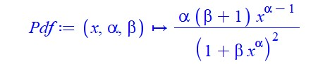
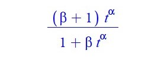
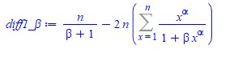

# Practica 1 Metodo de la transformacion inversa

Aplicar el método de la transformación inversa y/o el de aceptación rechazo para construir una función en R que genere datos de la siguiente distribución:

**Distribución log exponencial-geométrica (Jodra y Jimenez, 2020)**: 
  


Con dominio **x={0..1}, α > 0, β > 0**
  

## Metodo de transformacion Inversa

Para el calculo de la función de distribucion acumulada dada una funcion de densidad usando el metodo de la transformacion inversa requiere de calculos matematicos complejos por lo que es necesario usar algun software matematico para la resolucion de integrales, inversa, derivadas, etc. En este caso se decidio usar Maple el cual, es un paquete matematico multiplataforma, bastante intuitivo y sencillo de usar. Teniendo en cuenta lo mensionado se procede a seguir los siguiente pasos para la aplicacion del metodo de transformacion inversa:


1. Se define la funcion de densidad en Maple
  
   >Pdf := (x, alpha, beta) -> alpha*(beta + 1)*x^(alpha - 1)/(1 + beta*x^alpha)^2;
  
   


2. Integramos y simplificamos la funcion de densidad
  
   >(int(Pdf(x, alpha, beta), x = 0 .. t) assuming (0 < alpha, -1 < beta));simplify(%);
  
   

3. La función de distribución acumulada quedaria como se muestra acontinuacion:

   >Cdf := (x, alpha, beta) -> (beta + 1)*x^alpha/(1 + beta*x^alpha)
  
   

4. Se calcula la función inversa de la función de distribución acumulada y se simplifica

   >solve(Cdf(x,alpha,beta)=u,x);simplify(%);
  
  

5. La función inversa de F o función cuantil:

   >Q := (u, alpha, beta) -> (-u/(beta*u - beta - 1))^(1/alpha)
  
   
  

6. Una vez calculada la funcion inversa se procede a programar en R una funcion para crear de forma automatizada muestras aleatorias que siguen la Distribución log exponencial-geométrica (Jodra y Jimenez, 2020). 


### Importar librerías necesarias
```{r setup, warning=FALSE,message=FALSE}
library("ggplot2")
library("dplyr")         # load
library("RcmdrMisc")
library("nleqslv")       # Resolver sistema ecuaciones lineales/no lineales
library("matrixcalc")
library("zeallot")       #Many parameters
library("fitdistrplus")  # ajustan por maxima verosimilitud distribuciones univariadas de un listado
library("goftest") 

```

### Funcion de Distribución log exponencial-geométrica en R 

Definimos función en R que aplica el metodo de la transformacion inversa la cual como su nombre lo indica hace uso de la funcion inversa de la distribucion acumulada, tambien llamada funcion funcion cuantil que al pasarle como parametros un vector de tamaño n que sigue una distribucion Uniforme(0,1), y los estimadores alpha y beta restorna un vector de tamaño n que siguen una distruibucion log exponencial-geométrica (Jodra y Jimenez, 2020). Tambien se  define la Función de densidad PdfX para validar la correctitud de las variables aleatorias creadas con la función DatosJoJ. 
```{r}
# Función para generar v.a.i.i.d siguiendo dist. log exponencial-geométrica
DatosJoJi <- function(α,β,n){
  # α -> valor del estimador alpha
  # β -> valor del estimador beta
  # n -> tamaño del vector de variables aleatorias que se quieren generar
  
  VectorUnif<-runif(n,0,1) # n datos uniforme(0,1)

  # funcion cuartil evaluda
  return ((- VectorUnif /( β * VectorUnif - β - 1))^(1/α))

}

# Funcion de densidad
PdfX<- function(x,n){(α*(1 + β)*x^(α-1))/(1 + β*x^α)^2 }

```

### Muestras aleatoria que sigen la distribución log exponencial-geométrica
```{r}
# Declaramos los valores de α,β,n
α=3; 
β=2;
n=1000;

# Llamamos la funcion DatosJoJi con sus respectivos parametros
Dist_log_exp_geometrica = DatosJoJi(α,β,n)

# Graficamos un histograma con las variables obtenidas
Hist(Dist_log_exp_geometrica, scale="density", breaks="Sturges", col="darkgray")

# Añadimos la curva de validacion a la grafica
curve(PdfX(x), from=0, to=1.0, lwd=2, cex = 1.1, col="red",add=TRUE)

```

---


# Practica 2 Métodos de Estimación

Implementar en R un Métodos de Estimación para la siguiente funcion de densidad:

**Distribución log exponencial-geométrica (Jodra y Jimenez, 2020)**: 
  


Con dominio **x={0..1}, α > 0, β > 0**

Para el calulo de los estimadores existen varios metodos, en este caso nos centraremos en el metodo de los momentos y maxima verosimilitud.

## Metodo de los Momentos 

Se usar el metodo de los momento para determinar los estimadores alpha y beta, por lo que seguimos los siguientes pasos:

1. Definimos la funcion en elsoftware matematico Maple

   >Pdf := (x, alpha, beta) -> alpha*(beta + 1)*x^(alpha - 1)/(1 + beta*x^alpha)^2

2. Integramos la funcion usando el software Maple 

   En este caso como es necesario determinar el valor de los estimadores alpha y beta entonces calculamos las siguientes integrales.

   >(int(x*Pdf(x, alpha, beta), x = 0 .. 1) assuming (0 < alpha, 0 < beta));
  simplify(%);

   >(int(x^2*Pdf(x, alpha, beta), x = 0 .. 1) assuming (0 < alpha, 0 < beta));
  simplify(%);

3. Los momentos respecto al origen son:

   

### Metodo de los momentos
```{r}
VData = DatosJoJi(α,β,n) # n muestras aleatorias

M1 = mean(VData)   # Momentos muestrales 
M2 = mean(VData^2) # Momentos muestrales

# Funcion con el sistema de ecuaciones
SistemaM <- function(x) {
    # ALPHA x[1]
    # BETA x[2]
  
    y <- numeric(2)
    y[1] <- (x[1]*(x[2]+1) - 1^(x[1]+1)/(1+x[2]*1^(x[1]))^2 )-M1
    y[2] <- (x[1]*(x[2]+1) - 1^(x[1]+2)/(1+x[2]*1^(x[1]))^2 )-M2
    return(y) 
}

# Resolver el sistema
xstart <- c(0.1,1) # puntos de inicio para los estimadores
SolSistem<-nleqslv(xstart, SistemaM, jacobian=TRUE)

# Estimaciones metodo de los momentos:
alphaM = SolSistem$x[1]; 
message(sprintf("alphaM = %s por metodo de los momentos", alphaM))
betaM = SolSistem$x[2]; 
message(sprintf("betaM = %s por metodo de los momentos", betaM))
```


Estos resultados obtenidos con la funcion implementada permiten comprobar que el método de los momentos no te permite obtener estimadores de los parámetros para esta funcion. Esto se deduce tambien al  ver el resultado de los momentos respecto al origen, tanto beta como alpha son argumentos de la función de Lerch y no es posible obtener estimaciones resolviendo el sistema formado por las ecuaciones E[X]-M1=0 y E[X^2]-M2=0, siendo M1 y M2 los momentos muestrales de orden 1 y 2, respectivamente.


## Metodo de maxima verosimilitud

Sea X una poblacion con distribucion log exponencial-geométrica (Jodra y Jimenez, 2020) con estimadores alpha y beta y con funcion de densidad:

  

Con dominio **x={0..1}, α > 0, β > 0**

Se desea calcular el estimador maximo verosimil para alpha y beta a partir de una mustra aleatoria simple de tamaño n. Para lograr el objetivo empleando el metodo de maxima verosimilitud seguimos los siguientes pasos:

1. Escribir la verosimilitud de la funcion de densidad resultando:

   

2. Aplicar logaritmo a la funcion verosimil obtenida previamente para lograr la funcion de log-verosimilitud:

   

3. Calcular las primeras derivadas:

   - Primera derivada respecto alpha
  
     
  
   - Primera derivada respecto beta
  
     
    
4. Determinar la matrix Hessiana 

   Dado que se desea calcular el valor de dos estimadores la condicion de maximo local de la solucion (alpha^, betha^) se determinara a partir de la matriz hessiana de log L(α, β).Por lo que se calcula las segundas derivadas de la funcion.
 
### Implementacion del Metodo de Maxima verosimilitud en R
```{r}
# Funcion de log-verosimilitud:
LogLike <- function(params){
  alpha = params[1]
  beta = params[2]
  x = miid
  
  LL = sum(n*log(alpha) + n*log(beta + 1) + n*(alpha - 1)*log(x) - 2*n*log(1 + beta*x^alpha))
  return(LL)
}

# Definicion de la funcion Gradiente 
Gradiente <- function(params){
  alpha = params[1] # valor inicial de alpha
  beta = params[2]  # valor inicial de beta
  x = miid
  
  Grad1<-sum(n/alpha +n* log(x) - 2*n*beta*x^alpha*log(x)/(1 + beta*x^alpha))
  
  Grad2<-sum(n/(beta + 1) - 2*n*x^alpha/(1 + beta*x^alpha))
  
  Gradi<-c(Grad1,Grad2)

  return(Gradi)
}

# Definicion de la funcion para el calculo de las segundas derivadas
seg_derivadas<-function(params){
  alpha = params[1]
  beta = params[2]
  x = miid
  
  A11 = sum((-1)*(n/alpha^2) - 2*n*beta*(log(x)^2)*(x^alpha)/(1 + beta*x^alpha)^2)

  A12 = sum((-2)*n*(log(x)*x^alpha)/(1 + beta*x^alpha)^2)

  A22 = sum((-1)*n/(beta + 1)^2 - 2*n*(x^(2*alpha))/(1 + beta*x^alpha)^2)
  return(c(A11,A12,A22))

}


```

Una vez estimados los parametros es necesario hacer caculos necesarios para validar que el  Hessiano es definido negativo. Para la construccion del Hesiano se deben calcular las derivadas seguindas, para evitar estos calculos se empleara el el metodo de 


Broyden–Fletcher–Goldfarb–Shanno(BFGS) con el paquete de R que trae implementado el metodo constrOptim el cual unicamente necesita la función y su gradiente, pero no la matriz Hessiana. Por el contraria este la proporciona.

#### Metodo de resolucion tradicional
```{r}
# Declaramos los valores de α,β,n
α=2; 
β=3;    
n=10000; # Numero de datos a generar

miid = DatosJoJi(α,β,n)

# Punto de inicio el valor de alphaM y betaM
# obtenido por el metodo de los momentos
inicio<-c(1,1) 

SolSistema<-nleqslv(inicio, fn=Gradiente)

# Soluciones del sistema
alphaMV = SolSistema$x[1]
message(sprintf("alphaMV = %s por metodo de MV", alphaMV))

betaMV = SolSistema$x[2]
message(sprintf("betaMV = %s por metodo de MV", betaMV))

# Inicio el valor de alphaMV y betaMV obtenido
va = LogLike(c(alphaMV,betaMV)) # Evalua Log-likelihood
message(sprintf("Valor de Log-likelihood en el optimo es 
                va = %s ", va))

c(A11, A12, A22) %<-% seg_derivadas(inicio)

Determ = A11%*%A22-A12%*%A12
A11 # Primer menor: ha de ser negativo")
Determ # Segundo menor: ha de ser postivo:")

```

#### Algoritmo BFGS
```{r}
inicio<-c(1,1) 

# Algoritmo BFGS
SolBFGS<-constrOptim(inicio,LogLike,Gradiente, method="BFGS", ui=rbind(c(1,0), c(0,1)), ci=c(0,0), control=list(fnscale=-1),hessian=TRUE)

# Estimaciones de parametros
alphaMV = SolBFGS$par[1]
message(sprintf("alphaMV = %s por metodo de MV ", alphaMV))

betaMV = SolBFGS$par[2]
message(sprintf("betaMV = %s por metodo de MV ", betaMV))

message(sprintf("Valor de log-verosimilitud lv = %s ", SolBFGS$value))

H = SolBFGS$hessian
message(sprintf("Proporciona la matriz hessiana H= "))
H

message(sprintf("Determinante de H es det(H) = %s ", det(H)))

# Comprobamos la matriz hessiana con las soluciones BFGS es definida negativa
# library(matrixcalc)

message(sprintf("La matriz es definida negativa[%s]",is.negative.definite(H)))

```
#### Algoritmo de Nelder-Mead
```{r}
# Algoritmo de Nelder-Mead
SolNelderMead<-constrOptim(inicio,LogLike,Gradiente,method="Nelder-Mead",
 ui=rbind(c(1,0), c(0,1)), ci=c(0,0), control=list(fnscale=-1),hessian=TRUE)

# Estimaciones de parametros
alphaMV = SolNelderMead$par[1]
message(sprintf("alphaMV = %s por metodo de MV ", alphaMV))
betaMV = SolNelderMead$par[2]
message(sprintf("betaMV = %s por metodo de MV ", betaMV))
message(sprintf("Valor de log-verosimilitud lv = %s ", SolNelderMead$value)) # Valor de log-verosimilitud

Hsn = SolNelderMead$hessian # Proporciona la matriz hessiana
message(sprintf("Proporciona la matriz hessiana Hsn="))
Hsn

message(sprintf("La matriz es definida negativa[%s]", is.negative.definite(Hsn)))

```


##### Intervalos de confianza
```{r}
beta = betaMV
alpha = alphaMV

# CONTINUACION: Matriz de Informacion de Fisher Esperada (MIFE)11
# Funciones de (segundas derivadas * funcion de densidad)
fa11 = function(x){
  (sum((-1)*(n/alpha^2) - 2*n*beta*(log(x)^2)*(x^alpha)/(1 + beta*x^alpha)^2))*(alpha*(beta + 1)*x^(alpha - 1)/(1 + beta*x^alpha)^2)
}

fa22=function(x){
  (sum((-1)*n/(beta + 1)^2 - 2*n*(x^(2*alpha))/(1 + beta*x^alpha)^2))*(alpha*(beta + 1)*x^(alpha - 1)/(1 + beta*x^alpha)^2)
  
}

fa12=function(x){
  (sum((-2)*n*(log(x)*x^alpha)/(1 + beta*x^alpha)^2))*(alpha*(beta + 1)*x^(alpha - 1)/(1 + beta*x^alpha)^2)
}


# Terminos (esperanzas) de la Matriz de Informacion de Fisher Esperada
a11=-n*integrate(f=fa11,lower=0,upper=1)$value
a22=-n*integrate(f=fa22,lower=0,upper=1)$value
a12=-n*integrate(f=fa12,lower=0,upper=1)$value

# EFI: matriz de informacion de Fisher Esperada
EFI<-matrix(c(a11,a12,a12,a22),ncol=2,byrow=TRUE)

# Inversa de la matriz de informacion de Fisher Esperada
InvEFI<-solve(EFI)
InvEFI[1,1]; 
InvEFI[2,2] # Varianzas asintoticas de alpha MV y beta MV

# IC asintotico alpha (95%):
AlphaLower<-alphaMV-qnorm(0.975)*sqrt(InvEFI[1,1])
AlphaUpper<-alphaMV+qnorm(0.975)*sqrt(InvEFI[1,1])
print(c(AlphaLower,AlphaUpper))

# IC asintotico beta (95%):
BetaLower<-betaMV-qnorm(0.975)*sqrt(InvEFI[2,2])
BetaUpper<-betaMV+qnorm(0.975)*sqrt(InvEFI[2,2])
print(c(BetaLower,BetaUpper))

```


```{r}
# IC asintoticos desde la Matriz de Informacion de Fisher OBSERVADA
# Alternativa 1: Utilizar la matriz hessiana proporcionada por constrOptim()
H=SolBFGS$hessian # Proporciona la matriz hessiana
InvH=solve(-H); InvH

# IC asintotico alpha (95%):
AlphaLower<-alphaMV-qnorm(0.975)*sqrt(InvH[1,1])
AlphaUpper<-alphaMV+qnorm(0.975)*sqrt(InvH[1,1])
print(c(AlphaLower,AlphaUpper))

# IC asintotico beta (95%):
BetaLower<-betaMV-qnorm(0.975)*sqrt(InvH[2,2])
BetaUpper<-betaMV+qnorm(0.975)*sqrt(InvH[2,2])
print(c(BetaLower,BetaUpper))

```


---

# Practica 3 Monte Carlos

Realizar un estudio de simulacion Monte Carlo para analizar y comparar el rendimiento de este metodo con el metodo de maxima verosimilitud. Para ello implementaremos en R una funcion para para analizar el comportamiento del metodo de maxima verosimilitud para estimar los parametros de la siguiente distribución:

**Distribución log exponencial-geométrica (Jodra y Jimenez, 2020)**: 
  


Con dominio **x={0..1}, α > 0, β > 0**


```{r}
# Declaramos los valores de α,β,n
α=2; 
β=3;    
n=1000; # Numero de datos a generar
muestras=10^4 # Muestras a generar
i = 0 # Iterador
inicio <- c(1,1)

# Vectores donde almacenar las estimaciones de cada iteracion
alphaMV_list = rep(0,muestras)
betaMV_list = rep(0,muestras)

while(i <= muestras){
  # Generar n muestras aleatorias
  miid = DatosJoJi(α,β,n)
  
  # Algoritmo BFGS
  SolBFGS<-constrOptim(inicio, LogLike, Gradiente ,method="BFGS", ui=rbind(c(1,0), c(0,1)), ci=c(0,0), control=list(fnscale=-1),hessian=TRUE)
  
  # Estimaciones de parametros
  alphaMV = SolBFGS$par[1]
  betaMV = SolBFGS$par[2]
  
  H = SolBFGS$hessian
  is_neg = is.negative.definite(H)
     
  if((is_neg) & (alphaMV>0)&(betaMV >0)){
    
    alphaMV_list[i] = alphaMV
    betaMV_list[i] = betaMV
    i=i+1
  }
  
}  
  
  
# Estimaciones medias:
alphaMV = mean(alphaMV_list) 
alphaMV
betaMV = mean(betaMV_list)
betaMV

# Sesgos:
mean(alphaMV_list)-α
mean(betaMV_list)-β

# Error cuadratico medio:
mean((alphaMV_list-α)^2) 
mean((betaMV_list-β)^2)

```


```{r}
alpha = alphaMV
beta = betaMV

# Terminos (esperanzas) de la Matriz de Informacion de Fisher Esperada
a11=-n*integrate(f=fa11,lower=0,upper=1)$value
a22=-n*integrate(f=fa22,lower=0,upper=1)$value
a12=-n*integrate(f=fa12,lower=0,upper=1)$value

# EFI: matriz de informacion de Fisher Esperada
EFI<-matrix(c(a11,a12,a12,a22),ncol=2,byrow=TRUE)

# Inversa de la matriz de informacion de Fisher Esperada
InvEFI<-solve(EFI)
InvEFI[1,1]; 
InvEFI[2,2] # Varianzas asintoticas de alpha MV y beta MV

# IC asintotico alpha (95%):
AlphaLower<-alphaMV-qnorm(0.975)*sqrt(InvEFI[1,1])
AlphaUpper<-alphaMV+qnorm(0.975)*sqrt(InvEFI[1,1])
print(c(AlphaLower,AlphaUpper))

# IC asintotico beta (95%):
BetaLower<-betaMV-qnorm(0.975)*sqrt(InvEFI[2,2])
BetaUpper<-betaMV+qnorm(0.975)*sqrt(InvEFI[2,2])
print(c(BetaLower,BetaUpper))

```


---

# Practica 4: Ajuste de Distribuciones 
```{r}
# Definimos los datos
datos = c(0.013, 0.065, 0.111, 0.111, 0.163, 0.309, 0.426, 0.535, 0.684, 0.747, 0.997,
1.284, 1.304, 1.647, 1.829, 2.336, 2.838, 3.269, 3.977, 3.981, 4.520, 4.789, 4.849, 5.202, 5.291,
5.349, 5.911, 6.018, 6.427, 6.456, 6.572, 7.023, 7.087, 7.291, 7.787, 8.596, 9.388, 10.261, 10.713,
11.658, 13.006, 13.388, 13.842, 17.152, 17.283, 19.418, 23.471, 24.777, 32.795, 48.105)

# Resumen de los datos
numSummary(datos[, drop=FALSE], statistics=c("mean", "sd", "IQR", "quantiles", "skewness", "kurtosis"), quantiles=c(0,.25,.5,.75,1))

# Graficamos el histograma 
Hist(datos, scale="density", breaks="Sturges", col="darkgray")

# Graficamos boxplot de los datos 
boxplot(datos)


```
Podemos deducir por el valor obtenido de skewness que la cualquiera que sea la distribucion que siguen los datos tiene una simetria positiva por lo que procede
a ajustar mediante el metodo de maxima verosimilitud tres modelos: exponencial,
gamma y Weibull usando la libreria fitdistrplus de R que posee estas distribuciones ya definidas. En caso de no obtener una buena aproximacion se tendria que emplear otro paquete como AdequacyModel.

## Ajuste de modelos clasicos: Exponencial
```{r}
ajuste1<-fitdist(datos,method=c("ml"),"exp")
summary(ajuste1)
plot(ajuste1)

# varianza del estimador, es decir, (Std. Error)
vcov(ajuste1) # Matriz de varianzas y covarianzas (ajuste1$vcov)

# Coef. de correlacion entre la cdf teorica (exponencial) y la empirica2
Dataset=sort(datos) # Datos ordenados
lambda = 0.0003269265
TheorExpoCdfDatos<-1-exp(-lambda*Dataset)# Cdf de la exponencial
Empi = ecdf(Dataset) # Cdf empirica de los datos
cor(Empi(Dataset),TheorExpoCdfDatos) # Coef. de correlacion

# One-sample Kolmogorov-Smirnov
ks.test(datos,"pexp", rate=0.1278606)

# One-sample Anderson-Darling test
ad.test(datos,"pexp", rate=0.1278606)

# One-sample Cramer-von Mises
cvm.test(datos,"pexp", rate=0.1278606)

```

## Ajuste de modelos clasicos: Gamma
```{r}
juste2<-fitdist(datos,method=c("ml"),"gamma")
summary(ajuste2)
plot(ajuste2)
vcov(ajuste2)

# Coef. de correlacion entre la cdf teorica (gamma) y la empirica
Dataset<-sort(datos)
shape<-0.69538647
rate<-0.08889248
TheorGammaCdfDatos<-pgamma(Dataset, shape, rate) # cdf de Gamma
EmpiG <- ecdf(Dataset) # cdf emprica de los datos
cor(EmpiG(Dataset),TheorGammaCdfDatos) # Coef. de correlacion


ks.test(datos,"pgamma", shape=0.69538647,rate=0.08889248)

ad.test(datos,"pgamma", shape=0.69538647,rate=0.08889248)

cvm.test(datos,"pgamma", shape=0.69538647,rate=0.08889248)


```

## Ajuste de modelos clasicos: Weibull
```{r}
ajuste3<-fitdist(datos,method=c("ml"),"weibull")
summary(ajuste3); plot(ajuste3); vcov(ajuste3)


# Coef. de correlacion entre la cdf teorica (Weibull) y la empirica
Dataset<-sort(datos)
a<-0.8003306 #shape
b<-6.9697288 #scale
TheorWeibullCdfDatos<- 1 - exp(-(Dataset/b)*a) # cdf de Weibull
EmpiW <- ecdf(Dataset) # cdf emprica de los datos
cor(EmpiW(Dataset),TheorWeibullCdfDatos) # Coef. de correlacion


ks.test(datos,"pweibull", shape=0.8003306,scale=6.9697288)

ad.test(datos,"pweibull", shape=0.8003306,scale=6.9697288)

cvm.test(datos,"pweibull", shape=0.8003306,scale=6.9697288)


```

## Tabla resumen con los de resultados 

  |  Modelo     | Estimaciones MV (Std. Error) |    log L  |     AIC     |     BIC    |
  |:-----------:|:----------------------------:|:---------:|:-----------:|:-------------:|
  |  EXPONENCIAL     |   rate 0.0003269265   |   -152.8407  |  307.6815  |  309.5935    |   
  | GAMMA     |   shape:0.69538647 (0.1184192)	 rate:0.08889248 (0.0213603)	   |   -150.3153    |   304.6306 |     308.4546      |  
  | WEIBULL |   shape	0.8003306 (0.0907104) scale:6.9697288 (1.2921910)     |   -150.6768    |  305.3535   |    309.1776    |


  |  Modelo     |  Kolmogorov-Smirnov p-valor |  Anderson-Darling p-valor | Cramer-von Mises p-valor |
  |:-----------:|:---------------------------:|:---------:|:-----------:|
  | EXPONENCIAL |      0.5935    |     0.263   |   0.5383 |                  
  | GAMMA       |     0.6401     |    0.9077   |   0.7682 |                 
  | WEIBULL     |     0.5598     |    0.8124   |   0.6823 |
  
  


  
  
  
  