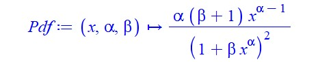
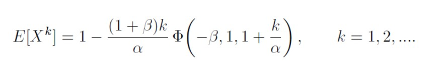
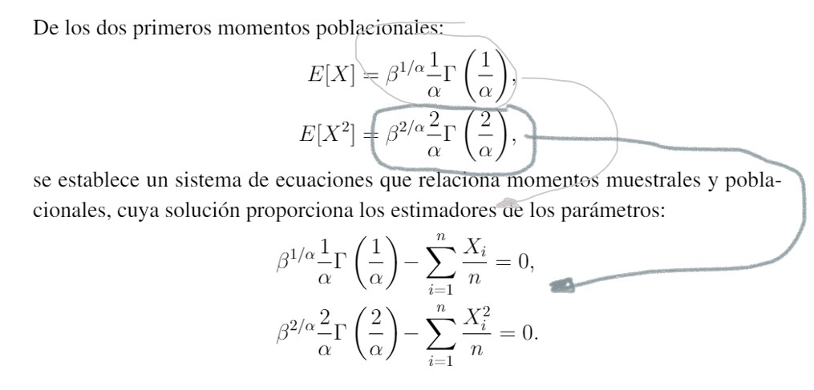
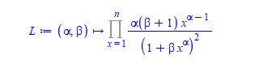
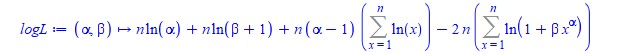
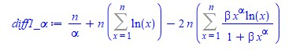
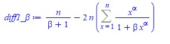

# Practica 1 

Aplicar el método de la transformación inversa y/o el de aceptación rechazo para construir una función en R que genere datos de la siguientes distribuciones:

5. **Distribución log exponencial-geométrica (Jodra y Jimenez, 2020)**: 
´


## Metodo de transformacion Inversa

Para el calculo de la función de densidad usando el metodo de la transformacion inversa es requerido llevar a cabo una serie de calculo matematicos, por practicidad se usa el software Maple. Maple es un paquete matematico multiplataforma, bastante intuitivo que permite resolver multiples problemas matematicos. Aclarado este punto se procede a seguir los siguiente pasos:

  1. Se define la funcion de densidad
  
  >Pdf := (x, alpha, beta) -> alpha*(beta + 1)*x^(alpha - 1)/(1 + beta*x^alpha)^2;
  
  

  2. Integramos y simplificamos la funcion de densidad
  
  >(int(Pdf(x, alpha, beta), x = 0 .. t) assuming (0 < alpha, -1 < beta));simplify(%);
  
  

  3. La función de distribución acumulada es:

  >Cdf := (x, alpha, beta) -> (beta + 1)*x^alpha/(1 + beta*x^alpha)
  
  

  4. Se calcula la función inversa de la función de distribución acumulada y se simplifica

  >solve(Cdf(x,alpha,beta)=u,x);simplify(%);
  
  

  5. La función inversa de F o función cuantil es:

  >Q := (u, alpha, beta) -> (-u/(beta*u - beta - 1))^(1/alpha)
  
  
  

  6. Una vez calculada la funcion inverda se procede a programar en R una funcion para crear de forma automatizada muestras aleatorias que siguen la Distribución log exponencial-geométrica (Jodra y Jimenez, 2020).

### Importar librerías necesarias
```{r setup, warning=FALSE,message=FALSE}
library("ggplot2")
library("dplyr")         # load
library("RcmdrMisc")
library("nleqslv")       # Resolver sistema ecuaciones lineales/no lineales
library("matrixcalc")

```

### Funcion de Distribución log exponencial-geométrica en R 
```{r}

# Definimos función para generar variables aleatoria siguiendo 
# la Distribución log exponencial-geométrica (Jodra y Jimenez, 2020)
DatosJoJi <- function(α,β,n){
  # La función recibe los parámetros
  # α -> valor deseado para alpha
  # β -> valor deseado para beta
  # n -> tamaño del vector de variables aleatorias que quieren generar
  
  # Generar "n" datos uniforme (0,1):
  VectorUnif<-runif(n,0,1)
  
  # Generar datos de la Distribución log exponencial-geométrica (Jodra y Jimenez, 2020)
  # mediante la función cuantil:
  
  return ((- VectorUnif /( β * VectorUnif - β - 1))^(1/α))
  #return(((β*(-VectorUnif) - 1)/(β^2*(VectorUnif - 1)))^(1/α))

}

# Definimos la Función de densidad PdfX para validar la correctitud de 
# las variables aleatorias creadas con la función DatosJoJi 
PdfX<- function(x,n){(α*(1 + β)*x^(α-1))/(1 + β*x^α)^2 }
#PdfX<- function(x) {(α/β)*x^(α-1)*exp(-x^α/β)}


# Declaramos los valores de α,β,n
α=3; 
β=2;
n=1000;

# Llamamos la funcion DatosJoJi con sus respectivos parametros
Dist_log_exp_geometrica <- DatosJoJi(α,β,n)

# Graficamos un histograma con las variables obtenidas
Hist(Dist_log_exp_geometrica, scale="density", breaks="Sturges", col="darkgray")

# Añadimos la curva de validacion a la grafica
curve(PdfX(x), from=0, to=1.0, lwd=2, cex = 1.1, col="red",add=TRUE)

```


---

# Practica 2

Enunciado: Implementar en R, la lección de Métodos de Estimación,sección 1.3. de la siguiente funcion de densidad:

5. **Distribución log exponencial-geométrica (Jodra y Jimenez, 2020)**: 


Para el calulo de los estimadores existen varios metodos, en este caso nos centraremos en el metodo de los momentos y maxima verosimilitud.

## Metodo de los Momentos 

Se usar el metodo de los momento para determinar los estimadores alpha y beta, por lo que seguimos los siguientes pasos:

1. Definimos la funcion

>Pdf := (x, alpha, beta) -> alpha*(beta + 1)*x^(alpha - 1)/(1 + beta*x^alpha)^2

2. Integramos la funcion usando el software Maple 

>(int(x*Pdf(x, alpha, beta), x = 0 .. 1) assuming (0 < alpha, 0 < beta));
simplify(%);

>(int(x^2*Pdf(x, alpha, beta), x = 0 .. 1) assuming (0 < alpha, 0 < beta));
simplify(%);

3. Los momentos respecto al origen son:


4. Transcribir eso 


## Metodo de los momentos
```{r}
# Declaramos los valores de α,β,n
α=2; 
β=3;    
n=1000; # Numero de datos a generar

VData = DatosJoJi(α,β,n) # generamos n muestras aleatorias con la funcion de distribucion

M1 = mean(VData)   # Momentos muestrales 
M2 = mean(VData^2) # Momentos muestrales

# Funcion con el sistema de ecuaciones
SistemaM <- function(x) {
    # ALPHA x[1]
    # BETA x[2]
  
    y <- numeric(2)
    y[1] <- (x[1]*(x[2]+1) - 1^(x[1]+1)/(1+x[2]*1^(x[1]))^2 )-M1
    y[2] <- (x[1]*(x[2]+1) - 1^(x[1]+2)/(1+x[2]*1^(x[1]))^2 )-M2
    return(y) 
}

# Resolver el sistema
xstart <- c(0.1,1) 
SolSistem<-nleqslv(xstart, SistemaM, jacobian=TRUE)

# Estimaciones metodo de los momentos:
alphaM = SolSistem$x[1]; 
message(sprintf("alphaM = %s por metodo de los momentos", alphaM))
betaM = SolSistem$x[2]; 
message(sprintf("betaM = %s por metodo de los momentos", betaM))


```

Estos resultados obtenidos con la funcion implementada permiten comprobar que el método de los momentos no te permite obtener estimadores de los parámetros para esta funcion. Esto se deduce tambien al  ver el resultado de los momentos respecto al origen, tanto beta como alpha son argumentos de la función de Lerch y no es posible obtener estimaciones resolviendo el sistema formado por las ecuaciones E[X]-M1=0 y E[X^2]-M2=0, siendo M1 y M2 los momentos muestrales de orden 1 y 2, respectivamente.


## Metodo de maxima verosimilitud

Sea X una poblacion con distribucion log exponencial-geométrica (Jodra y Jimenez, 2020) de dos parametros con funcion de densidad:

  

Se desea calcular el estimador maximo verosimil para alpha y beta a partir de una mustra aleatoria simple de tamaño n. Para lograr el objetivo empleando el metodo de maxima verosimilitud seguimos los siguientes pasos:

1. Escribir la verosimilitud de la funcion de densidad resultando:

rdesg

2. Aplicamos log a la funcion obtenida previamente para lograr la funcion de log-verosimilitud:

rdesg

3. Las primeras derivadas son:

    - Primera derivada respecto alpha
  
    rdesg
  
    - Primera derivada respecto beta
  
    rdesg
    

La condicion de m ´ aximo local de la soluci ´ on´ (ˆα, βˆ) se determinara a partir de la ´
matriz hessiana de log L(α, β):


### Implementacion del Metodo de Maxima verosimilitud en R 
```{r}
# Funcion de log-verosimilitud:
LogLike <- function(params){
  alpha = params[1]
  beta = params[2]
  
  LL = sum(n*log(alpha) + n*log(beta + 1) + n*(alpha - 1)*log(miid) - 2*n*log(1 + beta*miid^alpha))
  
  return(LL)
}

# Gradiente (primeras derivadas)
Gradiente<-function(params){
  alpha = params[1]
  beta = params[2]

  Grad1<-sum(n/alpha +n* log(miid) - 2*n*beta*miid^alpha*log(miid)/(1 + beta*miid^alpha))
  
  Grad2<-sum(n/(beta + 1) - 2*n*miid^alpha/(1 + beta*miid^alpha))
  
  Gradi<-c(Grad1,Grad2)

  return(Gradi)
}

# Declaramos los valores de α,β,n
α=2; 
β=3;    
n=10000; # Numero de datos a generar

# generamos n muestras aleatorias con la funcion de distribucion
miid = DatosJoJi(α,β,n)


# Punto de inicio el valor de alphaM y betaM
# obtenido por el metodo de los momentos
inicio<-c(alphaM,betaM) 

SolSistema<-nleqslv(inicio, fn=Gradiente)

# Soluciones del sistema
alphaMV = SolSistema$x[1]
message(sprintf("alphaMV = %s por metodo de MV", alphaMV))

betaMV = SolSistema$x[2]
message(sprintf("betaMV = %s por metodo de MV", betaMV))

# Inicio el valor de alphaMV y betaMV obtenido
inicio<-c(alphaMV,betaMV)

va = LogLike(inicio) # Evalua Log-likelihood

message(sprintf("Valor de Log-likelihood en el optimo es 
                va = %s ", va))
```

```{r}
alpha = alphaMV
beta = betaMV

# Chequear hessiano es definido negativo
# Componentes del hessiano (evaluado en los datos y con las estimaciones MV)
A11 = sum((-1)*(n/alpha^2) - 2*n*beta*(log(miid)^2)*(miid^alpha)/(1 + beta*miid^alpha)^2)
A12 = sum((-2)*n*(log(miid)*miid^alpha)/(1 + beta*miid^alpha)^2)
A22 = sum((-1)*n/(beta + 1)^2 - 2*n*(miid^(2*alpha))/(1 + beta*miid^alpha)^2)


Determ = A11%*%A22-A12%*%A12
A11 # Primer menor: ha de ser negativo")
Determ # Segundo menor: ha de ser postivo:")

inicio<-c(alpha,beta)

# Algoritmo BFGS
SolBFGS<-constrOptim(inicio,LogLike,Gradiente,method="BFGS", ui=rbind(c(1,0), c(0,1)), ci=c(0,0), control=list(fnscale=-1),hessian=TRUE)


# Estimaciones de parametros
alphaMV = SolBFGS$par[1]
message("vala")
message(sprintf("alphaMV = %s por metodo de MV", alphaMV))

betaMV = SolBFGS$par[2]
message(sprintf("betaMV = %s por metodo de MV", betaMV))

```
Una vez estimados los parametros es necesario hacer caculos necesarios para validar que el  Hessiano es definido negativo. Para la construccion del Hesiano se deben calcular las derivadas seguindas, para evitar estos calculos se empleara el el metodo de 
Broyden–Fletcher–Goldfarb–Shanno(BFGS) con el paquete de R que trae implementado el metodo constrOptim el cual unicamente necesita la función y su gradiente, pero no la matriz Hessiana. Por el contraria este la proporciona.

```{r}

# Algoritmo BFGS
SolBFGS<-constrOptim(inicio,LogLike,Gradiente,method="BFGS", ui=rbind(c(1,0), c(0,1)), ci=c(0,0), control=list(fnscale=-1),hessian=TRUE)

# Estimaciones de parametros
alphaMV = SolBFGS$par[1]
message(sprintf("alphaMV = %s por metodo de MV ", alphaMV))

betaMV = SolBFGS$par[2]
message(sprintf("betaMV = %s por metodo de MV ", betaMV))

message(sprintf("Valor de log-verosimilitud lv = %s ", SolBFGS$value))

H = SolBFGS$hessian
message(sprintf("Proporciona la matriz hessiana H= "))
H

message(sprintf("Determinante de H es det(H) = %s ", det(H)))

# Comprobamos la matriz hessiana con las soluciones BFGS es definida negativa
# library(matrixcalc)
is.negative.definite(H)

```

```{r}
# Algoritmo de Nelder-Mead
SolNelderMead<-constrOptim(inicio,LogLike,Gradiente,method="Nelder-Mead",
 ui=rbind(c(1,0), c(0,1)), ci=c(0,0), control=list(fnscale=-1),hessian=TRUE)

# Estimaciones de parametros
SolNelderMead$par[1]; SolNelderMead$par[2]
SolNelderMead$value # Valor de log-verosimilitud
SolNelderMead$hessian # Proporciona la matriz hessiana

is.negative.definite(SolNelderMead$hessian)

```

# Intervalos de confianza
```{r}
beta = betaMV
alpha = alphaMV

# CONTINUACION: Matriz de Informacion de Fisher Esperada (MIFE)11
# Funciones de (segundas derivadas * funcion de densidad)
fa11 = function(x){
  (sum((-1)*(n/alpha^2) - 2*n*beta*(log(x)^2)*(x^alpha)/(1 + beta*x^alpha)^2))*(alpha*(beta + 1)*x^(alpha - 1)/(1 + beta*x^alpha)^2)
}

fa22=function(x){
  (sum((-1)*n/(beta + 1)^2 - 2*n*(x^(2*alpha))/(1 + beta*x^alpha)^2))*(alpha*(beta + 1)*x^(alpha - 1)/(1 + beta*x^alpha)^2)
  
}

fa12=function(x){
  (sum((-2)*n*(log(x)*x^alpha)/(1 + beta*x^alpha)^2))*(alpha*(beta + 1)*x^(alpha - 1)/(1 + beta*x^alpha)^2)
}


# Terminos (esperanzas) de la Matriz de Informacion de Fisher Esperada
a11=-n*integrate(f=fa11,lower=0,upper=1)$value
a22=-n*integrate(f=fa22,lower=0,upper=1)$value
a12=-n*integrate(f=fa12,lower=0,upper=1)$value

# EFI: matriz de informacion de Fisher Esperada
EFI<-matrix(c(a11,a12,a12,a22),ncol=2,byrow=TRUE)

# Inversa de la matriz de informacion de Fisher Esperada
InvEFI<-solve(EFI)
InvEFI[1,1]; 
InvEFI[2,2] # Varianzas asintoticas de alpha MV y beta MV


```


```{r}
# IC asintotico alpha (95%):
AlphaLower<-alphaMV-qnorm(0.975)*sqrt(InvEFI[1,1])
AlphaUpper<-alphaMV+qnorm(0.975)*sqrt(InvEFI[1,1])
print(c(AlphaLower,AlphaUpper))

# IC asintotico beta (95%):
BetaLower<-betaMV-qnorm(0.975)*sqrt(InvEFI[2,2])
BetaUpper<-betaMV+qnorm(0.975)*sqrt(InvEFI[2,2])
print(c(BetaLower,BetaUpper))

# IC asintoticos desde la Matriz de Informacion de Fisher OBSERVADA
# Alternativa 1: Utilizar la matriz hessiana proporcionada por constrOptim()
H=SolBFGS$hessian # Proporciona la matriz hessiana
InvH=solve(-H); InvH

# IC asintotico alpha (95%):
AlphaLower<-alphaMV-qnorm(0.975)*sqrt(InvH[1,1])
AlphaUpper<-alphaMV+qnorm(0.975)*sqrt(InvH[1,1])
print(c(AlphaLower,AlphaUpper))

# IC asintotico beta (95%):
BetaLower<-betaMV-qnorm(0.975)*sqrt(InvH[2,2])
BetaUpper<-betaMV+qnorm(0.975)*sqrt(InvH[2,2])
print(c(BetaLower,BetaUpper))

```


---

# Practica 3 Monte Carlos

Los estudiantes de Análisis Avanzado de Datos tienen asignado
un número que se corresponde con el ejemplo que tienen que
implementar en R, de la lección Simulación Monte Carlo,
sección 1.5. 

```{r}
library(nleqslv) # Resolver sistema de ecuaciones
library(matrixcalc) # Comprobar matriz hessiana negativa
Alpha=2; Beta=3 #Valor exacto de los parametros:
N=10^4 # Muestras a generar
num=50 # Tama~no de cada muestra
# Generar vector datos Weibull
VectorDatosW<-function(Alpha,Beta,num){
VectorUnif<-runif(num,0,1)
WEIB<- ((-Beta)*log(1-VectorUnif))^(1/Alpha)}

# Vectores donde almacenar las estimaciones de cada iteracion
AlphaMV<-rep(0,N)
BetaMV<-rep(0,N)

# CONTINUACION
ini<-1 # Iteracion
while(ini<=N){
  
VData<-VectorDatosW(Alpha,Beta,num) # Generar datos Weibull(Alpha,Beta)


M1<-mean(VData);
M2<-mean(VData^2) # Momentos muestrales
xstart <- c(1,1) # Punto de inicio para resolver el sistema

SistemaM <- function(x) {
  y <- numeric(2)
  y[1] <- x[2]^(1/x[1])*(1/x[1])*gamma(1/x[1])-M1
  y[2] <- x[2]^(2/x[1])*(2/x[1])*gamma(2/x[1])-M2
  return(y)

}


SolSistem<-nleqslv(xstart, SistemaM, jacobian=TRUE) # Resolver sistema
# Estimaciones metodo de los momentos (si pertenecen al espacio parametrico):
# Estas estimaciones son punto de inicio para resolver problema de optimizacion
if((SolSistem$x[1]>0) & (SolSistem$x[2]>0)){
Inicio<-c(SolSistem$x[1],SolSistem$x[2])
# Funcion de log-verosimilitud loglik <- function(param){
alpha <- param[1];beta <- param[2]
LL<- sum(log(alpha)-log(beta)+(alpha-1)*log(VData)-(1/beta)*VData^(alpha))}

# CONTINUACION
Gradiente<-function(param){
  alpha <- param[1]; beta <- param[2]
Grad1<-sum((1/alpha)+log(VData)-(1/beta)*(log(VData)*VData^(alpha)))
Grad2<-sum((-1/beta)+(1/beta^2)*VData^(alpha))
Gradi<-c(Grad1,Grad2)
}
# Resolver el problema de optimizacion:
ResBFGS<-constrOptim(Inicio,loglik ,Gradiente, method="BFGS",
ui=rbind(c(1,0), c(0,1)), ci=c(0,0), control=list(fnscale=-1),hessian=TRUE)
H=ResBFGS$hessian
is.negative.definite(H) # Comprobar matriz hesiana definida negativa
if((is.negative.definite(H)==TRUE)&(ResBFGS$par[1]>0)&(ResBFGS$par[2]>0)){
AlphaMV[ini]<-ResBFGS$par[1]; 
BetaMV[ini]<-ResBFGS$par[2]
ini=ini+1}

}


# endInicio } # endWhile
# Estimaciones medias:
mean(AlphaMV); mean(BetaMV)
# Sesgos:
mean(AlphaMV)-Alpha; mean(BetaMV)-Beta
# Error cuadratico medio:
mean((AlphaMV-Alpha)^2); mean((BetaMV-Beta)^2)


# CONTINUACION: Matriz de Informacion de Fisher Esperada3
# Funciones de (segundas derivadas * funcion de densidad)
fa11=function(x){(-1/Alpha^2-x^Alpha*log(x)^2/Beta)
*(Alpha/Beta*x^(Alpha-1)*exp(-x^Alpha/Beta))}
fa22=function(x){(1/Beta^2-2*x^Alpha/Beta^3)
*(Alpha/Beta*x^(Alpha-1)*exp(-x^Alpha/Beta))}
fa12=function(x){(x^Alpha*log(x)/Beta^2)
*(Alpha/Beta*x^(Alpha-1)*exp(-x^Alpha/Beta))} # Terminos (esperanzas) de la
# Matriz de Informacion de Fisher Esperada
a11=-num*integrate(f=fa11,lower=0,upper=Inf)$value
a22=-num*integrate(f=fa22,lower=0,upper=Inf)$value
a12=-num*integrate(f=fa12,lower=0,upper=Inf)$value
# EFI: matriz de informacion de Fisher Esperada
EFI<-matrix(c(a11,a12,a12,a22),ncol=2,byrow=TRUE)
# Inversa de la matriz de informacion de Fisher Esperada
InvEFI<-solve(EFI)
# Varianzas asintoticas de alpha y beta
InvEFI[1,1]; InvEFI[2,2]

```


